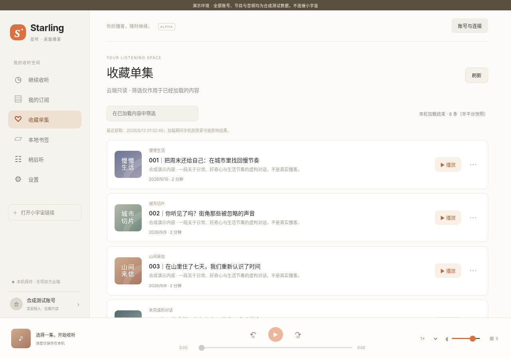

# Starling · 星听

面向 **Windows 11 x64** 的非官方小宇宙桌面客户端开发版。

**版本：0.1.0-alpha.1。交付的是源码、已构建前端、测试与构建脚本，不是已经过真实账号和 Windows 实机验收的安装包。**

独立界面，Go 核心 + Wails 2 宿主 + TypeScript + SQLite。没有项目方服务器；不复制 Horizon 的 GPL 代码。原创代码采用 MIT，平台内容与商标不在该许可证授权范围内。



## 已实现与尚未验证

| 模块 | 当前情况 |
|---|---|
| 短信登录、身份核对、会话续期 | 提供小宇宙 App 扫码与实验短信适配器；真实扫码完成后的个人库访问尚未完成验收，默认关闭 |
| 订阅 / 收藏单集 | 独立列表、分页、去重、取消、完整缓存替换；真实接口的当前兼容性待验证 |
| 公开链接 / 详情 | 仅支持小宇宙完整节目或单集链接；公开网页 JSON 解析、说明清洗、时间点跳转 |
| 播放 | 单一 audio、切歌竞态保护、暂停、进度拖动、±15/30 秒、倍速、音量；合成 WAV 浏览器测试通过 |
| 本地状态 | 书签、待播队列、断点续播、账号隔离；重启不自动播放 |
| Windows 原生 | 托盘、媒体键、睡眠暂停、用户级 DPAPI、系统 SQLite、单实例锁已编写；独立模块交叉编译通过，**未实机执行** |
| 完整 Wails 程序 | 已在 Windows x64 完成构建并启动主窗口；完整账号与播放验收仍待完成 |
| 安装 / 更新 | 提供便携构建、当前用户安装与卸载脚本；没有签名、自动更新或应用商店分发 |

### 必须理解的账号边界

当前认证适配器支持官方网页使用的**小宇宙 App 扫码流程**及社区记录的主播后台短信接口，随后用听众个人资料接口重新核对身份。扫码实现与验证边界见 [扫码登录说明](docs/QR_LOGIN.md)。旧短信实现未包含当前官方网页的人机验证流程，可能无法发送。它不是已获得授权的 OAuth 接入，也不保证主播后台凭据可用于每个听众账号。第三方接入可能被拒绝、失效或触发风控；不能把技术实现当成平台许可。

该开发版不伪造移动设备指纹，不绕过验证码、访问控制或付费限制，不扫描浏览器 / App 的已有会话，不使用公共第三方账号代理。若平台拒绝访问，客户端明确报错，不进行无限重试或把失败显示成空收藏。

**PRD 的 G1、G2、G3 仍未全部通过，因此本版本不能作为“已完成的账号版 MVP”公开宣传。** 见 [需求映射](docs/PRD_TRACEABILITY.md) 和 [真实环境验收清单](docs/REAL_ENVIRONMENT_CHECKLIST.md)。

## 在 Windows 上构建

前提：64 位 Windows 11，Go、Node.js/npm，以及可使用的 WebView2 运行时。构建脚本需要访问 Go 模块和 npm 源，不会关闭 TLS / 校验数据库，也不会改变系统脚本执行策略。

语言下限由 `go.mod` 声明为 Go 1.26.0，项目工具链与 CI 配置固定 Go 1.26.8；本轮 Windows 验证使用 Go 1.26.8 / Node 24.5.0。Wails 固定为 **2.11.0**，TypeScript 固定为 **5.8.3**，前端有实际生成的 `package-lock.json`。这些是开发基线，不是完成安全审计后的公开发布工具链。

从项目根目录执行：

```powershell
powershell -NoProfile -File .\scripts\build-windows.ps1
```

项目要求 Go 1.26.0 以上，工具链锁定 1.26.8。脚本在临时双模块 workspace 中下载并校验依赖，分别运行根模块和宿主的测试/静态检查及前端测试，再构建程序。成功后输出到 `build\Starling.exe`，并生成 SHA-256 清单。两个模块的实际 `go.sum` 均已纳入源码。常规构建前请退出 Starling，避免绑定生成触发单实例检查。

需要保持当前程序运行、避免桌面被打扰时，可使用 `powershell -NoProfile -File .\scripts\build-windows.ps1 -Candidate`。它跳过绑定生成、输出 `build\Starling-candidate.exe` 和独立哈希清单，不启动、关闭或替换现有程序。如果默认候选也在运行，可追加 `-CandidateName Starling-candidate-r2`，生成另一个文件和独立哈希清单；脚本仍拒绝覆盖运行中的同名目标。当前 JSON `Call` 桥签名未变；修改宿主绑定签名后，应在方便时执行常规构建验证。

脚本执行受组织策略限制时，按组织批准方式执行，不需要为了使用项目而关闭系统安全功能。也可以逐条运行相同命令：

```powershell
$env:CGO_ENABLED = "0"
go test ./...
go vet ./...
cd frontend
npm ci --ignore-scripts
npm test
cd ../desktop
go test ./...
go vet ./...
go run github.com/wailsapp/wails/v2/cmd/wails@v2.11.0 build -platform windows/amd64 -clean
```

上面的手工构建默认输出在 `desktop/build/bin/`；构建脚本会额外复制到根目录 `build/`。直接双击便携程序即可启动，不要求安装。请先审查源码和发布边界，再决定是否启用实验账号接入。

### 当前用户安装 / 卸载

```powershell
powershell -NoProfile -File .\scripts\install.ps1
powershell -NoProfile -File .\scripts\uninstall.ps1
# 明确选择同时删除用户数据：
powershell -NoProfile -File .\scripts\uninstall.ps1 -RemoveData
```

安装位置：`%LOCALAPPDATA%\Programs\Starling`。数据位置：`%APPDATA%\Starling`。脚本不自动结束正在运行的进程。默认卸载保留数据；`-RemoveData` 才会清除。运行中的 WebView 缓存以退出后 / 下次启动时的尽力清理为界，不承诺取证级擦除。

## 运行合成演示，不连接真实账号

演示是独立的 `cmd/demo`，不会被桌面生产入口引用。其账号、列表和 120 秒低音量测试音频均为合成数据；测试数据只存在临时目录中，正常退出后删除。

```sh
cd frontend
npm ci --ignore-scripts
npm run build
cd ..
go run ./cmd/demo
```

在浏览器打开 `http://127.0.0.1:34115/`。页面顶部始终有演示标记。可以用 `00000000000` / `0000` 测试表单，不会发送真实短信。Linux 运行该演示需要 GCC 与 `libsqlite3-dev`；Windows 使用系统 SQLite，无需 C 编译器。仅打开 `frontend/dist/index.html` 不会自动连接后端。

## 测试

```sh
go test ./...             # 根模块，联网测试默认跳过
go test -race ./...       # 需要支持 CGo 的工具链；历史 Linux 结果不代表当前 Windows 已执行
go vet ./...
cd frontend && npm test   # 严格 TypeScript 编译 + Node 内置测试
```

浏览器集成测试需安装 Python Playwright 和 Chromium，然后在根目录运行 `python tests/e2e/run.py`。可设置 `CHROMIUM_PATH` 指向浏览器；默认使用 Playwright 安装的 Chromium。测试使用 headless、静音和独立临时配置，不操作用户浏览器；截图与结果保存在 `docs/test-results/`。本次 Windows Headless Chrome 直接连接本机合成后端，13 项通过；其中 2 项取消竞态使用 HTTP 响应拦截，仅在直连模式运行；历史受控内存测试路径可通过 `STARLING_E2E_IN_MEMORY=1` 使用。两者均**不等于原生 Wails / WebView2 实机测试**。

经明确授权后，可单独进行真实库只读检查：设置 `$env:STARLING_LIVE_LIBRARY='1'` 后运行 `go test ./internal/provider -run '^TestLiveLibraryReadOnly$' -v -count=1`，完成后移除该环境变量。只读本应用自己的受保护会话，不续期或写回凭据；输出页数和条数，不输出账号或内容。本次真实收藏/订阅分页已通过，手机端核对仍待完成。

发布前检查实际候选文件：

```powershell
go run golang.org/x/vuln/cmd/govulncheck@v1.8.0 -mode=binary build/Starling-candidate.exe
node scripts/dependency-report.mjs build/Starling-candidate.exe
```

依赖材料保存在 `build/compliance/`，包括 CycloneDX 清单与许可证文本。脚本校验候选二进制与当前依赖版本一致；许可证收集不代替专业审查。最新证据见 [测试报告](docs/TEST_REPORT.md)，全部遗留项见 [遗留工作](docs/REMAINING_WORK.md)。

## 目录

```text
internal/app/        业务编排与受限 JSON 桥
internal/provider/   实验平台适配、公开页面、分页契约
internal/session/    令牌轮换、single-flight、会话 epoch
internal/store/      参数化 SQLite、按账号隔离的本地数据
internal/sqlite/     Windows 系统 DLL / Linux cgo 薄绑定
internal/security/   URL 校验、DPAPI、原子凭据存储
internal/desktop/    原生托盘 / 媒体键 / 生命周期
frontend/src/        无第三方运行时的 TypeScript 界面与播放器
desktop/             独立 Wails Go 子模块及内嵌前端
cmd/demo/            仅合成数据的本地演示入口
tests/e2e/           浏览器集成测试
docs/                PRD、实现说明、验证证据与未完成项
```

公开发布前请先阅读 [SECURITY.md](SECURITY.md)、[隐私说明](PRIVACY.md) 和 [第三方参考与许可](THIRD_PARTY_NOTICES.md)。本仓库未替你创建或推送任何远程 GitHub 项目。
